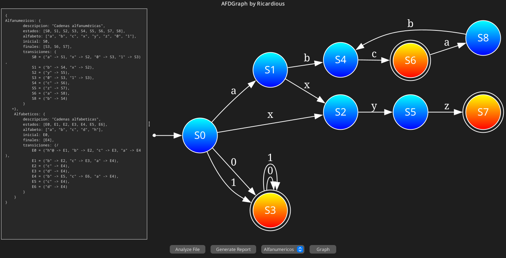
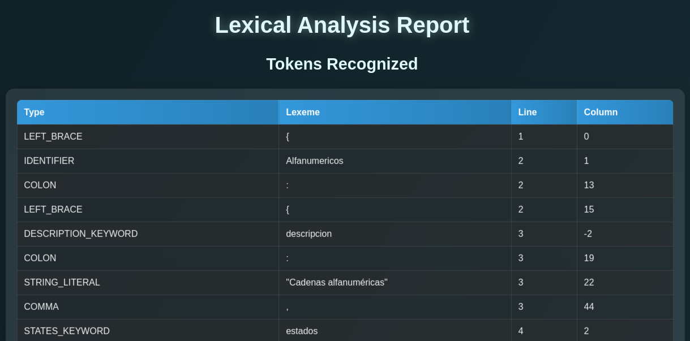

# 🧠 AFDGraph

Visualizador de Autómatas Finitos Deterministas desarrollado para el curso de **Lenguajes Formales y de Programación - 2025**.

> Autor: *Alex Ricardo Castañeda Rodríguez*  
> Carné: *202300476*

---

## 📌 Objetivo

Este proyecto tiene como objetivo **leer archivos `.lfp` que contienen la descripción de autómatas**, analizarlos léxicamente, representarlos gráficamente y generar reportes en HTML.

---

## 🖼️ Interfaz Gráfica



*Visualización del autómata, entrada `.lfp`, y acciones de análisis/reportes.*

---

## ⚙️ Funcionalidades

### ✅ Análisis de archivo `.lfp`
- Carga de archivo con autómatas.
- Análisis léxico e identificación de tokens y errores.

### 🧩 Visualización del AFD
- Renderizado de gráficas SVG usando **Graphviz** y **Apache Batik**.
- Soporte para zoom y pan.

### 📄 Generación de reportes
- HTML para **tokens reconocidos**.
- HTML para **errores léxicos**.

### 📆 Persistencia en memoria
- HashMap con los autómatas cargados.
- Permite múltiples autómatas por archivo.

---

## 📝 Estructura de Archivos

```
AFDGraph/
├── assets/                     # Recursos gráficos

├── data/
│   ├── input/                  # Archivos .lfp de entrada
│   ├── output/                 # Archivos SVG generados
│   └── reports/                # Reporte HTML de análisis léxico

├── docs/                       # Documentación del proyecto

├── src/
│   ├── main/java/com/afdgraph/
│   │   ├── export/            # Exportación de SVG con Graphviz
│   │   ├── lexer/             # Lexer y parser manual
│   │   ├── models/            # Clases de datos: Token, Automaton, etc.
│   │   ├── report/            # Generador del reporte HTML
│   │   └── ui/                # Interfaz gráfica con Swing
│   └── test/java/com/afdgraph/
│       └── ...                # Pruebas unitarias (JUnit)

├── pom.xml                    # Configuración Maven
├── README.md
```

---

## 📂 Archivos de entrada `.lfp`

```txt
AFD1: {
    descripcion: "Reconoce números",
    estados: [S0, S1],
    alfabeto: ["1", "2"],
    inicial: S0,
    finales: [S1],
    transiciones: {
        S0 = ("1" -> S1),
        S1 = ("2" -> S0)
    }
}
```

---

## 📊 Reporte de Tokens (vista previa)



⭐ *Puedes ver el reporte completo en [`/data/reports/lexical_report.html`](./data/reports/lexical_report.html).*

---

## 💻 Requisitos

- Java 17 o superior
- Graphviz instalado (para generar archivos `.svg`)
- Apache Batik (ya integrado en el proyecto)
- Maven (opcional, para empaquetado)

---

## 🧪 Ejecución

1. Clona el repositorio:

```bash
git clone https://github.com/ricardious/AFDGraph.git
```

2. Ejecuta `Main.java` desde tu IDE o terminal.
3. Carga un archivo `.lfp`, selecciona un AFD y grafica.

---

## 📚 Manuales

- 📘 [Manual Técnico](./docs/manual-tecnico.pdf)
- 🧑‍🏫 [Manual de Usuario](./docs/manual-usuario.pdf)

---

## 🧠 Autor y Reconocimiento

Proyecto desarrollado de forma individual como parte del curso de LFP 2025.  
Inspirado en los principios fundamentales de **autómatas finitos deterministas**.

---

## ⚠️ Aviso

> No se utilizó ningún generador léxico como ANTLR, JFlex o Lex.  
> El análisis se realizó con un AFD programado manualmente, carácter por carácter, según lo exigido por el proyecto.

